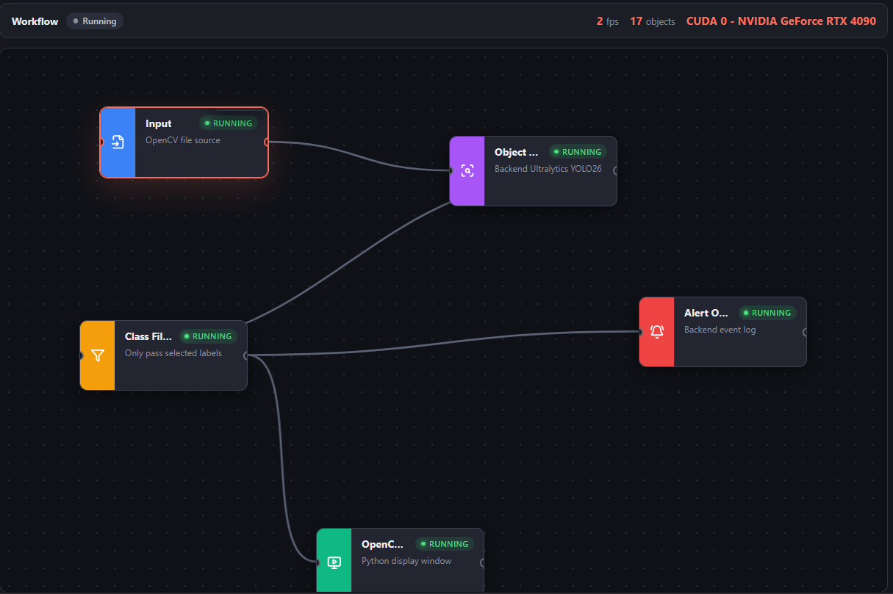
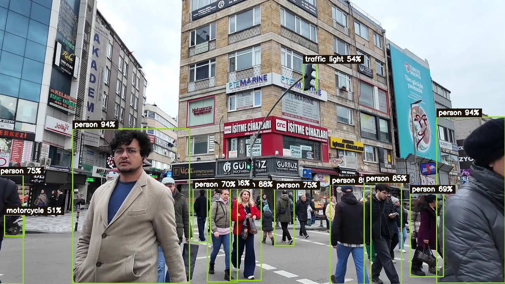

<div align="center">

# 🟢 VisoNode

### Build computer vision workflows without writing any code.

Connect a camera or video to an AI object-detection model and watch the results live —
all by dragging and linking boxes in your browser. No machine learning experience required.


[**Quick start**](#-quick-start) · [**Highlights**](#-highlights) · [**How it works**](#-how-it-works) · [**The nodes**](#-the-nodes) · [**Roadmap**](#-roadmap)



</div>

---

## ⚡ Quick start

```powershell
# 1. Install dependencies (CPU build — works on any computer)
.\.venv\Scripts\python.exe -m pip install -r requirements.txt

# 2. Start the app
.\.venv\Scripts\python.exe main.py

# 3. Open the editor in your browser
#    http://127.0.0.1:8000
```

Configure the nodes, click **Run**, and the detections appear in a live preview window.
Press **Stop**, `q`, or `Esc` to stop.

> **Have an NVIDIA GPU?** Run `.\scripts\install-gpu.ps1` instead of step 1 for a big speed-up.
> See [GPU acceleration](#gpu-acceleration) below.

---

## ✨ Highlights

- **No code.** Build the whole pipeline by connecting nodes in the browser.
- **100% local.** Your camera and video never leave your computer — nothing is sent to the cloud.
- **State-of-the-art detection.** Powered by Ultralytics **YOLO26**.
- **CPU or GPU.** Works on any machine; uses your NVIDIA GPU automatically when available.
- **Live feedback.** See frame rate, object count, and the active device in real time.
- **Flexible inputs.** Webcams, stream URLs, capture devices, or local image/video files.

A workflow is just a chain of nodes:

```text
Input  →  Object Detection  →  Class Filter  →  OpenCV Preview  →  Alert Output
```

Each node does one job: read frames, find objects, keep only the classes you care about,
draw the results, and log alerts. The detection results appear in a separate window, with
boxes and labels drawn over the video:



---

## 🔍 How it works

VisoNode runs entirely on **your own computer**:

- The **browser** is just the editor. You use it to lay out the nodes and change their settings.
- **Python** does the real work behind the scenes: opening the camera or file, running the
  YOLO26 AI model, filtering results, drawing boxes, and logging alerts.

When you click **Run**, the browser hands your workflow to Python, and Python opens a native
preview window showing the live detections. In the editor, each node turns green and shows
**RUNNING**, and the top bar reports the live frame rate, object count, and active device.

> **First run note:** the first time you use Object Detection, it automatically downloads the
> YOLO26 model weights (for example `yolo26n.pt`). This happens once and may take a moment.

### GPU acceleration

The [Quick start](#-quick-start) installs the CPU build, which works on any computer but is
slower. If you have an **NVIDIA GPU**, install the GPU-enabled build instead. This script
installs a CUDA build of PyTorch, installs the app, and runs a quick test to confirm the GPU
is detected:

```powershell
.\scripts\install-gpu.ps1
```

By default it installs the `cu128` driver wheels. To target a different CUDA version:

```powershell
.\scripts\install-gpu.ps1 -CudaWheel cu126
```

To check whether an existing install can see your GPU:

```powershell
.\scripts\check-gpu.ps1
```

---

## 🧩 The nodes

| Node | What it does |
| --- | --- |
| **Input** | Chooses where frames come from. *Camera mode* takes an OpenCV camera index, a stream URL, or a capture source plus resolution. *File mode* takes a local image or video path and can loop videos. |
| **Object Detection** | Runs an Ultralytics **YOLO26** model. Lets you pick the model size, confidence threshold, how often to run inference, and the CPU/GPU device. |
| **Class Filter** | Keeps only the object types you list — for example `person, car, dog`. |
| **OpenCV Preview** | Draws the bounding boxes and labels in a native preview window. |
| **Alert Output** | Logs detection events on the backend, with a cooldown so you aren't flooded. |

### Choosing CPU or GPU

The **Object Detection** node has a **Device** setting:

| Setting | What it does |
| --- | --- |
| **Auto** | Uses your NVIDIA GPU if one is available, otherwise falls back to CPU. |
| **CPU** | Always runs on the CPU. Works everywhere, slower. |
| **CUDA device** | Forces the GPU. Requires a working CUDA + PyTorch install, and reports an error if the GPU can't be used. |

If you're not sure, leave it on **Auto**.

---

## 🗺️ Roadmap

Planned improvements:

- Save and load workflows from a file.
- Built-in presets for RTSP / IP cameras.
- Use a monitor / screen as an input source.
- Extra inference nodes for ONNX and TensorRT.
- More output nodes: webhooks, database logging, and snapshot saving.

---

## 📄 License

This project is licensed under the **GNU Affero General Public License v3.0** — the same
open-source license used by Ultralytics. See [LICENSE](LICENSE).
